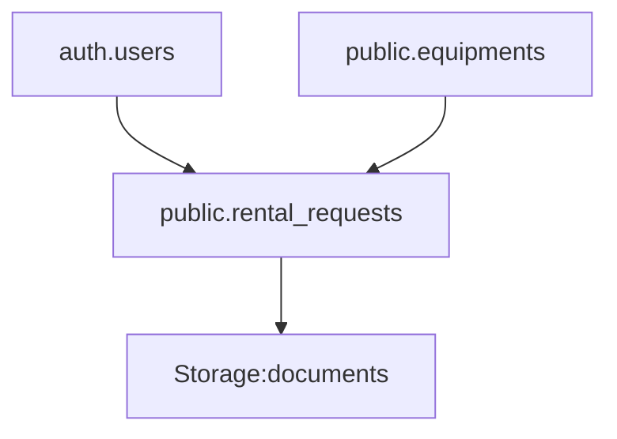

# Movie Equipment Rental System


A secure equipment rental management system for authorized personnel, built with Next.js and Supabase.

## Key Features
🔐 Role-based authentication  
📊 Dashboard with rent order management  
📝 Multi-step rental request form  
📁 Document upload integration  
🔄 Real-time equipment availability tracking

## Tech Stack
- **Frontend**: Next.js 14, Shadcn UI
- **Backend**: Supabase (PostgreSQL)
- **Styling**: Tailwind CSS
- **Language**: TypeScript

## Database Structure


## Getting Started

1. Clone repository
```bash
git clone [your-repo-url]
```

2. Install dependencies
```bash
npm install
```

3. Set up environment variables
```bash
echo "NEXT_PUBLIC_SUPABASE_URL=your_url
NEXT_PUBLIC_SUPABASE_ANON_KEY=your_key" > .env.local
```

4. Run development server
```bash
npm run dev
```

## Screenshots


*Dashboard interface showing recent rental requests*
