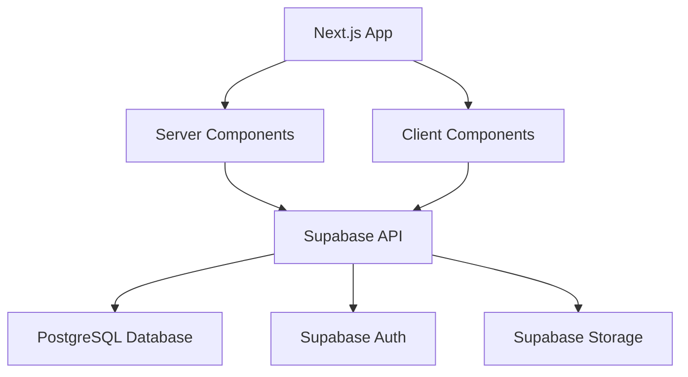

# Movie Equipment Rental System

A comprehensive equipment rental management system for film and video production companies, built with Next.js and Supabase. This application implements a complete workflow for equipment rental, from budget requests to equipment return and inspection.


## Key Features

🔐 **Role-Based Authentication**
- Different access levels for clients, equipment inspectors, financial inspectors, and managers
- Secure authentication using Supabase Auth
- Role-specific UI components and navigation

📊 **Interactive Rental Calendar**
- Month view calendar with color-coded rental cards
- Visual indicators for rental start and end dates
- Intuitive navigation between overlapping rentals

📝 **Multi-Step Rental Workflow**
- Complete rental lifecycle management
- Budget request and approval process
- Equipment inspection before and after rental
- Document management for contracts and receipts

📁 **Document Management**
- Upload and store rental-related documents
- Role-specific document access control
- Secure storage using Supabase Storage

🔄 **Real-Time Equipment Availability**
- Track equipment availability in real-time
- Prevent double-booking of equipment
- Inventory management with stock tracking

## Tech Stack

- **Frontend**: Next.js 14, React, TypeScript
- **UI Components**: Shadcn UI, Tailwind CSS
- **Backend**: Supabase (PostgreSQL)
- **Authentication**: Supabase Auth
- **File Storage**: Supabase Storage
- **Form Validation**: React Hook Form, Zod

## System Architecture

The application follows a modern architecture with server components, client components, and a PostgreSQL database:



### Database Structure

The system uses the following main tables:

- **auth.users** - User accounts and authentication
- **public.rental_requests** - Main rental order information
- **public.equipments** - Equipment inventory
- **public.equipment_inspections** - Inspection records
- **public.rental_documents** - Document storage metadata

## Role-Based Workflow

The system implements a comprehensive workflow for rental orders:

1. **Budget Request** (Client)
   - Clients submit rental requests with equipment needs
   - System assigns "Pending" status to the order

2. **Financial Approval** (Financial Inspector/Manager)
   - Financial staff reviews and approves budgets
   - Sets pricing and payment terms

3. **Equipment Initial Inspection** (Equipment Inspector/Manager)
   - Equipment condition is documented before rental
   - Photos and notes are recorded

4. **Contract Management** (Manager)
   - Contracts are generated and managed
   - Documents are stored securely

5. **Equipment Return Inspection** (Equipment Inspector/Manager)
   - Equipment condition is documented after return
   - Comparison with initial inspection

## User Roles

The system supports the following user roles:

- **Client**
  - Can submit rent order budget requests
  - Can view their own rent orders
  - Access limited to Client Information and Equipment Selection tabs

- **Equipment Inspector**
  - Can access rent order general information
  - Can perform equipment initial and final inspections
  - Access to Equipment Initial Inspection and Final Inspection tabs

- **Financial Inspector**
  - Can approve budgets and set pricing
  - Can mark orders as paid
  - Access to financial information and management

- **Manager**
  - Full access to all tabs and features
  - Can perform all operations in the system

## UI Components

The application uses a component-based architecture with reusable UI elements:

- **RentOrdersScheduler** - Main calendar view for rent orders
- **RentOrderDialog** - Multi-tab dialog for creating and editing rent orders
- **StretchedRentOrderCard** - Visual representation of rent orders in the calendar


## Getting Started

### Prerequisites

- Node.js 18+ and npm
- Supabase account

### Installation

1. Clone the repository
```bash
git clone https://github.com/ViniciusBrown/equipment-rent-system-v3.git
cd equipment-rent-system-v3
```

2. Install dependencies
```bash
npm install
```

3. Set up environment variables
```bash
cp .env.example .env.local
# Edit .env.local with your Supabase credentials
```

4. Run the development server
```bash
npm run dev
```

5. Open [http://localhost:3000](http://localhost:3000) in your browser

## Deployment

The application can be deployed to Vercel or any other Next.js-compatible hosting service:

```bash
npm run build
npm run start
```

## Demo Video

Check out this demo video showcasing the smooth workflow of the application:

https://github.com/ViniciusBrown/equipment-rent-system-v3/raw/main/static/smooth_flow.mp4

## My Rent Requests

Clients can view and manage their own rental requests in a dedicated page:


## License

This project is licensed under the MIT License - see the LICENSE file for details.

## Acknowledgements

- [Next.js](https://nextjs.org/)
- [Supabase](https://supabase.io/)
- [Shadcn UI](https://ui.shadcn.com/)
- [Tailwind CSS](https://tailwindcss.com/)
- [Lucide Icons](https://lucide.dev/)
